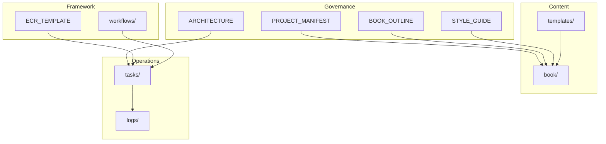

# Architecture

Архитектура репозитория **Vibe Coding Bible** и **Vibe Publishing Framework**.

Version: 0.2.0  
Status: Active

---

## 1. Обзор

Репозиторий — **knowledge monorepo**: единый источник знаний для книги, документации, шаблонов и процессов. Контент (что пишем) отделён от инфраструктуры (как работаем).

```
┌─────────────────────────────────────────────────────────────┐
│                    Vibe Coding Bible                        │
│                   (knowledge monorepo)                      │
├──────────────┬──────────────┬──────────────┬────────────────┤
│   Content    │   Governance │  Framework   │   Operations   │
│   book/      │   docs/      │  framework/  │   tasks/       │
│   templates/ │   docs/adr/  │              │   logs/        │
│   diagrams/  │              │              │   scripts/     │
│   examples/  │              │              │   build/       │
└──────────────┴──────────────┴──────────────┴────────────────┘
```

---

## 2. Слои архитектуры

### 2.1. Content Layer — контент

| Каталог | Назначение |
|---|---|
| `book/` | Текст книги: главы, организованные по частям |
| `templates/` | Шаблоны контента: главы, PRD, RFC, ADR |
| `diagrams/` | Диаграммы и иллюстрации |
| `examples/` | Эталонные фрагменты и примеры |

**Принцип:** один файл — одна глава или один артефакт. Именование: `NN-Part-X/NN-Chapter-Title.md`.

### 2.2. Governance Layer — управление

| Каталог / файл | Назначение |
|---|---|
| `docs/PROJECT_MANIFEST.md` | Миссия, принципы, стандарты |
| `docs/PROJECT_STATE.md` | Текущее состояние проекта |
| `docs/BOOK_OUTLINE.md` | Структура книги |
| `docs/STYLE_GUIDE.md` | Стиль и формат |
| `docs/EDITOR_GUIDE.md` | Руководство для редакторов |
| `docs/TERMINOLOGY.md` | Единая терминология |
| `docs/ROADMAP.md` | Дорожная карта |
| `docs/CHANGELOG.md` | История изменений |
| `docs/adr/` | Architecture Decision Records |

**Принцип:** управляющие документы — источник истины для людей и ИИ-агентов.

### 2.3. Framework Layer — процессы

| Каталог | Назначение |
|---|---|
| `framework/prompts/` | Универсальные промпты фреймворка |
| `framework/templates/` | Шаблоны ECR и служебных документов |
| `framework/rules/` | Правила и конвенции |
| `framework/workflows/` | Описания процессов (ECR lifecycle и др.) |
| `framework/schemas/` | Схемы метаданных (будущее) |
| `framework/checklists/` | Чек-листы фреймворка |

**Принцип:** framework переиспользуем — не привязан к теме конкретной книги.

### 2.4. Operations Layer — операции

| Каталог | Назначение |
|---|---|
| `tasks/backlog/` | ECR в очереди или запланированные |
| `tasks/active/` | ECR в работе или на ревью |
| `tasks/done/` | Завершённые ECR |
| `logs/completed/` | Отчёты о завершённых ECR |
| `scripts/` | Скрипты сборки |
| `build/` | Инструкции и артефакты сборки |
| `.github/` | CI/CD |

**Принцип:** каждое значимое изменение — ECR с отчётом.

### 2.5. AI Layer — работа с ИИ

| Каталог | Назначение |
|---|---|
| `prompts/` | Промпты, специфичные для книги |
| `docs/AI_CONTEXT.md` | Контекст, тон, правила для агентов |
| `.cursor/` | Конфигурация Cursor IDE |

**Принцип:** ИИ получает контекст из docs/ и prompts/, изменения оформляет через ECR.

### 2.6. Knowledge Extensions — расширения

| Каталог | Назначение |
|---|---|
| `playbooks/` | Пошаговые сценарии |
| `patterns/` | Паттерны и повторяемые решения |
| `checklists/` | Готовые чек-листы проекта |

---

## 3. Потоки данных

### 3.1. Написание главы

```
BOOK_OUTLINE → chapter.template → book/ → STYLE_GUIDE + TERMINOLOGY
```

### 3.2. Изменение репозитория (ECR)

```
Backlog → Planned → Active → Review → Done → logs/completed/
```

Подробнее: [framework/workflows/ecr-lifecycle.md](../framework/workflows/ecr-lifecycle.md)

### 3.3. Сборка артефактов

```
book/ + docs/ → scripts/build.sh → build/ → PDF | EPUB | HTML | ...
```

---

## 4. Разделение templates/

| Расположение | Содержимое |
|---|---|
| `templates/` | Шаблоны **контента** книги (главы, PRD, RFC, ADR) |
| `framework/templates/` | Шаблоны **процессов** (ECR, отчёты) |

Это намеренное разделение: контент vs операции.

---

## 5. Разделение prompts/

| Расположение | Содержимое |
|---|---|
| `prompts/` | Промпты для работы над **Vibe Coding Bible** |
| `framework/prompts/` | Универсальные промпты **Vibe Publishing Framework** |

---

## 6. ADR — архитектурные решения

Значимые решения фиксируются в `docs/adr/`:

- формат: `ADR-NNNN-short-title.md`
- первый документ: [ADR-0001-use-markdown.md](adr/ADR-0001-use-markdown.md)

Шаблон для новых ADR: [templates/adr.template.md](../templates/adr.template.md)

---

## 7. Конвенции

| Объект | Формат |
|---|---|
| ECR | `ECR-XXXX` |
| ADR | `ADR-NNNN` |
| Глава | `NN-Part-X/NN-Chapter-Title.md` |
| Отчёт ECR | `logs/completed/ECR-XXXX-report.md` |

---

## 8. Зависимости между компонентами



---

## 9. Связанные документы

- [PROJECT_MANIFEST.md](PROJECT_MANIFEST.md)
- [PROJECT_STATE.md](PROJECT_STATE.md)
- [framework/README.md](../framework/README.md)
- [framework/workflows/ecr-lifecycle.md](../framework/workflows/ecr-lifecycle.md)
- [tasks/README.md](../tasks/README.md)
