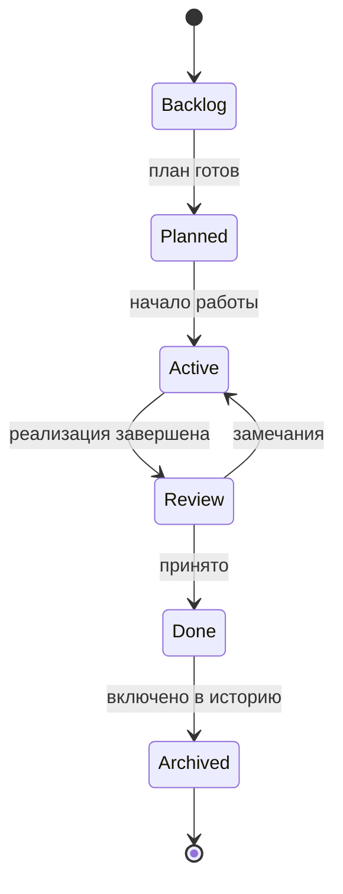

# ECR Lifecycle

Жизненный цикл Engineering Change Request (ECR) в Vibe Publishing Framework.

---

## Обзор

```
Backlog → Planned → Active → Review → Done → Archived
```

Каждая стадия имеет чёткие критерии входа и выхода. Физическое расположение файла задачи может не совпадать с логической стадией — см. раздел «Соответствие каталогам».

---

## Стадии

### 1. Backlog

**Описание:** идея или потребность зафиксирована, но работа ещё не спланирована.

**Критерии входа:**

- выявлена проблема, возможность или требование;
- назначен идентификатор ECR-XXXX;
- создан черновик по [ECR_TEMPLATE.md](../templates/ECR_TEMPLATE.md).

**Действия:**

- описать цель и причину;
- оценить масштаб (затрагиваемые файлы);
- при необходимости обсудить с участниками проекта.

**Критерии выхода:**

- цель и причина сформулированы;
- задача готова к планированию.

**Каталог:** `tasks/backlog/`

---

### 2. Planned

**Описание:** задача спланирована, объём и критерии готовности определены.

**Критерии входа:**

- ECR прошёл стадию Backlog;
- заполнены разделы «Изменения» и «Критерии готовности»;
- нет блокирующих зависимостей (или они задокументированы).

**Действия:**

- уточнить список затрагиваемых файлов;
- согласовать подход (при необходимости — ADR);
- назначить исполнителя (человек или ИИ-агент).

**Критерии выхода:**

- план изменений утверждён;
- исполнитель готов начать работу.

**Каталог:** `tasks/backlog/` (статус Planned отражается в front matter или заголовке файла)

---

### 3. Active

**Описание:** работа над ECR ведётся.

**Критерии входа:**

- ECR переведён из Planned;
- исполнитель начал реализацию.

**Действия:**

- вносить изменения в репозиторий согласно плану;
- обновлять ECR при отклонении от плана;
- не расширять scope без возврата в Planned.

**Критерии выхода:**

- все запланированные изменения внесены;
- выполнена самопроверка по разделу «Проверка» в ECR.

**Каталог:** `tasks/active/`

---

### 4. Review

**Описание:** изменения готовы к проверке.

**Критерии входа:**

- реализация завершена;
- ECR перемещён из Active;
- diff или список изменений доступен для ревью.

**Действия:**

- проверить критерии готовности;
- проверить согласованность с STYLE_GUIDE, TERMINOLOGY, ARCHITECTURE;
- при замечаниях — вернуть в Active с комментариями.

**Критерии выхода:**

- все критерии готовности выполнены;
- ревью пройдено (самостоятельно или участником проекта).

**Каталог:** `tasks/active/` (статус Review) или отдельный процесс через PR

---

### 5. Done

**Описание:** ECR принят и закрыт.

**Критерии входа:**

- Review пройден;
- Definition of Done выполнен.

**Действия:**

- переместить ECR в `tasks/done/`;
- создать отчёт в `logs/completed/ECR-XXXX-report.md`;
- обновить CHANGELOG (при релизе версии);
- обновить PROJECT_STATE (при значимых изменениях).

**Критерии выхода:**

- отчёт создан;
- ECR в `tasks/done/`.

**Каталог:** `tasks/done/`

---

### 6. Archived

**Описание:** ECR и отчёт сохранены как историческая запись, активная работа не ведётся.

**Критерии входа:**

- ECR в статусе Done;
- прошло достаточно времени или ECR включён в релиз.

**Действия:**

- отчёт остаётся в `logs/completed/`;
- при необходимости — ссылка из CHANGELOG или ROADMAP;
- ECR не изменяется (новые изменения — новый ECR).

**Каталог:** `tasks/done/` + `logs/completed/` (логически архивные, физически не перемещаются)

---

## Диаграмма переходов



---

## Соответствие каталогам tasks/

| Логическая стадия | Физический каталог | Примечание |
|---|---|---|
| Backlog, Planned | `tasks/backlog/` | Planned — уточнённый backlog |
| Active, Review | `tasks/active/` | Review — active перед закрытием |
| Done, Archived | `tasks/done/` | Archived — done без дальнейших правок |

Отчёты всегда создаются в `logs/completed/` при переходе в **Done**.

---

## Связанные документы

- [ECR_TEMPLATE.md](../templates/ECR_TEMPLATE.md)
- [tasks/README.md](../../tasks/README.md)
- [logs/README.md](../../logs/README.md)
- [docs/ARCHITECTURE.md](../../docs/ARCHITECTURE.md)
